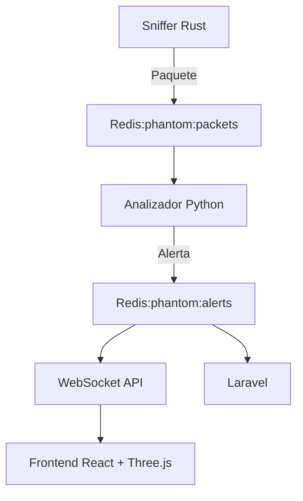

# PhantomTrace

PhantomTrace es una plataforma avanzada de **análisis de tráfico de red y trazado de ataques cibernéticos** en tiempo real, que combina tecnologías de bajo nivel como **Rust y C**, procesamiento en **Python**, comunicación asincrónica con **Redis + WebSocket**, visualización 3D interactiva en **React + Three.js**, y una arquitectura desplegable como app de escritorio mediante **Tauri**.

El sistema permite capturar tráfico, detectar patrones sospechosos (DoS, escaneos, ARP spoofing...), visualizar flujos entre nodos de red en 3D, y ejecutar ataques simulados para pruebas.

---

## 🏛️ Estructura del Proyecto

```
phantomtrace/
├── sniffer-rust/           # Captura de paquetes en red usando libpcap (Rust)
├── analyzer-python/        # Análisis de tráfico y detección de patrones (Python)
├── phantom-api/            # API REST + WebSocket (NestJS o FastAPI)
├── phantom-front/          # Interfaz 3D (React + Three.js + WebSocket)
├── phantom-laravel-back/   # Panel administrativo, usuarios, historial (Laravel)
├── simulator/              # Simulación de ataques (Python, C o Bash)
├── redis/                  # Redis como sistema de mensajería Pub/Sub
├── docker-compose.yml      # Orquestación de servicios
```

---

## 🛠️ Infraestructura General Configurada

* ✅ Captura de paquetes en **Rust** con `libpcap`
* ✅ Análisis en **Python** con suscripción a Redis (`phantom:packets`)
* ✅ Publicación de alertas a `phantom:alerts`
* ✅ Visualización 3D con React + Three.js
* ✅ WebSocket + Redis para comunicación en tiempo real
* ✅ Laravel como backend administrativo
* ✅ Simulador de ataques ejecutado desde WSL o contenedores
* ✅ App de escritorio con **Tauri** (React + Rust)

---

## 🛠️ Herramientas y Tecnologías Utilizadas

| Categoría        | Tecnologías                                        |
| ---------------- | -------------------------------------------------- |
| 🐳 Contenedores  | Docker, Docker Compose                             |
| 🧱 Bajo Nivel    | Rust (libpcap), C (binarios y parsers)             |
| 🔧 Análisis      | Python 3.11, Redis-py, Scapy                       |
| 📈 Frontend      | React 18, Three.js, WebSocket, TailwindCSS         |
| 🔄 Comunicación  | Redis, WebSocket, pub/sub                          |
| 📅 Backend Admin | Laravel 10, MariaDB, Sanctum                       |
| 📚 API Gateway   | NestJS 10 (o FastAPI), TypeScript, Axios           |
| 💪 Escritorio    | Tauri (Rust + Webview), compatible multiplataforma |
| 🔮 Dev Tools     | ESLint, Prettier, Jest, PostCSS, Vite, Cargo, Bash |

---

## 🔁 WebSocket & Redis (phantom-api)

| Componente           | Funcionalidad                                                                    |
| -------------------- | -------------------------------------------------------------------------------- |
| 🌐 WebSocket Server  | Envío de alertas en tiempo real al frontend                                      |
| 📢 Suscripción Redis | Escucha de `phantom:alerts` publicadas por el analizador Python                  |
| 📣 Publicación Redis | (Opcional) desde panel Laravel u otros servicios hacia Redis                     |
| 🔐 Autenticación WS  | (Opcional) control de acceso por token JWT                                       |
| 🚛 Integración       | Conectado con React, Laravel y Redis                                             |
| 📆 Dockerizado       | Ejecutable en contenedor independiente (NestJS/FastAPI con WebSocket habilitado) |

---

## 🪧 Backend (Laravel)

* Gestiona usuarios, roles, historial de alertas.
* Protege rutas con JWT o Laravel Sanctum.
* Conectado a MariaDB.
* Puede suscribirse a eventos Redis para registrar alertas.

---

## 🧲 Sniffer (Rust + libpcap)

* Se ejecuta desde **WSL** para acceso real a red.
* Captura paquetes en tiempo real.
* Filtra, resume y publica eventos en `phantom:packets` (Redis).
* Puede extenderse con C (FFI) para parsers avanzados.

---

## 🪥 Analizador (Python)

* Se suscribe a `phantom:packets`.
* Detecta patrones como:

  * Ping flood / DoS
  * ARP Spoofing
  * Port scanning
* Publica a `phantom:alerts`.
* Envia alertas al WebSocket gateway y Laravel.

---

## 📡 WebSocket & API (NestJS o FastAPI)

* Recibe alertas desde Redis (`phantom:alerts`).
* Las reenvía al frontend por WebSocket.
* Expone APIs REST para historial, configuración y control de simulaciones.

---

## 🎨 Frontend (phantom-front)

* Visualiza en tiempo real conexiones, nodos e interacciones.
* Usa Three.js para mostrar red como sistema 3D.
* Recibe alertas WebSocket y las representa visualmente.
* Permite ver historial y replay de ataques.

---

## 🎓 Simulador de ataques (simulator/)

* Scripts para:

  * Escaneo con Nmap o RustScan
  * ARP spoof con `arpspoof`
  * Flood de pings o SYN con binarios en C
* Ejecutables desde WSL o contenedores con `NET_RAW`

---

## 🚀 App de escritorio (Tauri)

* Empaqueta el frontend React como app nativa.
* Ejecuta procesos como sniffer y analizador desde el backend Rust.
* Compatible con Windows/macOS/Linux.
* Acceso a Redis, WebSocket y sistema de archivos nativo.

---

## 🛀 Redis (phantom-redis)

* Canal de comunicación central:

  * `phantom:packets` → del sniffer
  * `phantom:alerts` → del analizador
  * `phantom:simulations` → opcional para comandos
* Suscriptores: frontend, Laravel, API

---

## 🔄 Flujo General del Sistema



---

## 🚜 Despliegue y Desarrollo

* Cada módulo dockerizado salvo `sniffer-rust`, que corre desde WSL
* App de escritorio construida con Tauri: `tauri build`
* Scripts de ataque y test integrados en simulador
* Desarrollo modular: cada componente puede testearse y ejecutarse aislado

---

## 💡 Ideas Futuras

* Mapa geográfico de origen de ataques (GeoIP)
* Aprendizaje automático en detección de patrones
* Plugins embebidos en C o WASM para reglas personalizadas
* Integración con antivirus/IDS reales
* Exportación de capturas a formato PCAP

---

✍️ *By IanP*
